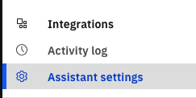
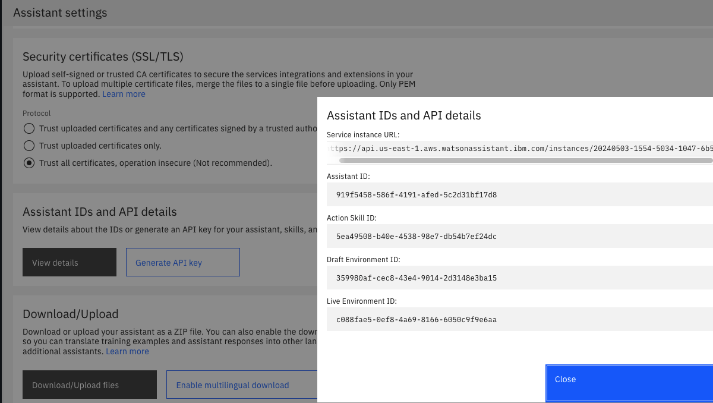

# Extracting watsonx Assistant feedback logs
After running a few tests and providing feedback on the generated answers, you can retrieve a CSV file of the complied feedback results. 

These feedback results will have the following information:
- query - Query asked to the assistant for retrieval
- llm_response - The response from the llm with the answer to user's query
- rating - The rating the user gave the generated answer
- comments - Any feedback provided about the generated answer.

To use the script you will need:
- python (tested on 3.10.11)
- pip (tested on 23.0.1)

## Setup

1. Create a virtual python environment
    
    Navigate to the directory that contains the logExtraction.py script. Run the following:
    ```
    python -m venv venv
    source ./venv/bin/activate
    ```

1. Install dependencies

    Run the following
    ```
    pip install requests
    ```

1. Set environment variables

    a. Create an API Key for your cloud account.  For information, go to [Creating and API key in the console](https://cloud.ibm.com/docs/account?topic=account-userapikey&interface=ui)
    

    b. Within the AI Assistant Builder, navigate to `Assistant Settings` at the bottom left of the page

     
    
    c. Then find the `Assistant IDs and API details` section and click on View details.

    

    d. Depending on which environment you are running in, copy either the `Draft Environment ID` or the `Live Environment ID` value. Also copy the`Service instance URL` value

    e. From your terminal, save off the following environment variables:

    ```
    export ASSISTANT_ENVIRONMENT_ID=xxxx
    export ASSISTANT_URL=xxxx
    export ASSISTANT_API_KEY=xxxx
    ```

## Running the script

1. From your terminal, run the following command:

    ```
    python loggingScript.py
    ```
    
    This will write a CSV file called `<date-time>_feedback.csv` to the same directory as the script. You can then review the feedback received from users in that file.

    
